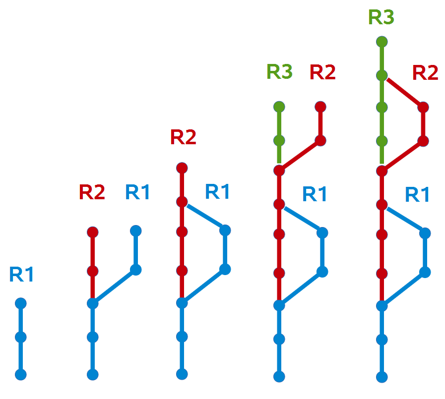
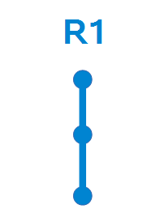
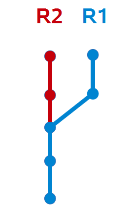
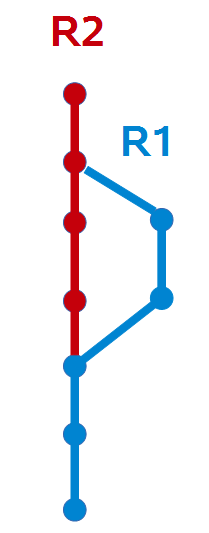
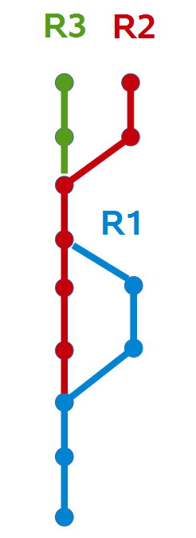
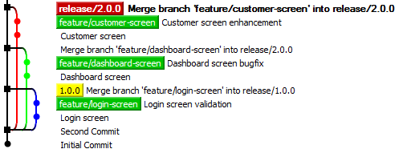

# A Lean Git branching model

**Lean Git Flow** eliminates waste by removing unnecessary branching and merging. It is particularly suited to teams on a regular release cycle, ie **monthly or quarterly**. To customise the workflow for your own team, feel free to [Fork It](https://help.github.com/articles/fork-a-repo/).

## Release 1.0.0 Branch
We start by creating a release branch. For now, this is also the **mainline** or **integration** branch:

    git checkout -b release/1.0.0

Release branches are named using [Semantic Versioning](http://semver.org/) i.e. **MAJOR.MINOR.PATCH**

## Release 2.0.0 Branch
As soon as we need to commit some code that will not be part of release/1.0.0, we create a release/2.0.0 branch. The release/2.0.0 branch now becomes the **mainline** or **integration** branch.

    git branch release/2.0.0

## Merge 1.0.0 into 2.0.0
Once release/1.0.0 has shipped, we merge it forward into release/2.0.0

    git checkout release/2.0.0
    git merge release/1.0.0

## Release 3.0.0 Branch
Again, once we need to commit code that will not be part of release/2.0.0, we create a release/3.0.0 branch.

    git branch release/3.0.0

## Continue Indefinitely
This process of creating one release branch per release and merging it forward can continue indefinitely.

## Delete the master branch
The term **master** can have different meanings depending on the context. With LeanGitFlow, we delete the master branch.

    git branch -d master

To delete the remote master branch use:

    git push origin --delete master

Remember, git branches are just pointers. By deleting master, we don't lose any code or commits, as long as we have already created a release branch.

## Feature Branch
A feature branch provides an isolated sandbox to do some work. That work could be a **bugfix**, a new **feature** or just an **experiment**. If you commit your work to a feature branch, it stays completely isolated from all other branches. This is very useful if you need to save your work and switch to working on a different task before the feature is complete.

    git checkout -b feature/login-screen

## Commit to your Feature Branch

    git commit -m "This is my new feature"

## Push your Feature Branch (or not)
If you want to share your feature branch with the team, push it to the central repo. This is often done so a code review can take place.

    git push origin feature/login-screen

Alternatively, you may decide to keep your feature branch locally and to skip this step.

## Merge to the release branch
Once you decide your feature is ready to target a particular release, merge it. You can do the merge locally or on the server using a [Pull Request](https://help.github.com/articles/using-pull-requests/). A Pull Request allows for a code review to take place. To do it locally use:

    git checkout release/1.0.0

    git merge feature/login-screen --no-ff

The **--no-ff** flag forces git to create a merge commit. This preserves the history that the feature branch existed.

## Example
This example shows 3 feature branches and one release branch. Only one of the feature branches has been merged back into the release branch.

This is a screenshot of a git repo viewed using the popular open source [TortoiseGit](https://code.google.com/p/tortoisegit/) client. It is important to be comfortable looking at real git histories like this, as conceptual flowcharts can be misleading.

## Tag Every Build
Every build is tagged by your CI Server using the [Semantic Versioning](http://semver.org/) convention: **MAJOR.MINOR.PATCH+BUILD**

    git tag 1.0.0+25

## Commit directly to the release branch
When appropriate, you may choose to commit directly to the release branch. You and your team decide if this is allowed. Use your best judgement when to use a feature branch and when to commit directly to the release branch. This is useful when you need to make a very small change like a spelling correction.

## Parallel Release Branches
It is normal to have multiple release branches in parallel. If you are developing a webapp, you may only ever have one or two release branches at a time. For example, one release branch may be for the final few bugfixes for an imminent release while a 2nd release branch is for new features that will be released further in the future. However, if your project is a library, you may have many versions in production and may have many release branches. Release branches are created off other release branches (or sometimes from tags).

    git checkout release/1.0.0
    git branch release/2.0.0
    git checkout release/2.0.0

## Tag Production Ready Code
When your code is deemed production ready, tag it. LeanGitFlow advocates [Semantic Versioning](http://semver.org/). Any commit with a tag in the form **1.0.0** is deemed a released version. Once the code is tagged/released, there should be no more commits on that release branch.

    git tag 1.0.0 release/1.0.0

If the code gets tagged in error, git allows you to delete the tag and to re-tag it. However, this should only be done if a tag was genuinely created in error.

## Merge Release Branches Forward
Once a release has shipped, it should be merged forward into any numerically higher release branches.

    git checkout release/2.0.0
    git merge release/1.0.0 --no-ff

## Lock or Delete Released Branches
Once a release has shipped and is is tagged, there is no more need for the release branch. At this point, the release branch should be deleted, or if your git server supports it, you may choose to lock it. Either way, it is important for the team to know that once the release is tagged, there are no more commits on that branch.

## Example
In this example, a 2nd release branch has been created and the two remaining features have been merged into it. We have also tagged release **1.0.0** and deleted the **release/1.0.0** branch.

## Branch from a tag
Release branches can be branched off other release branches or from a tag. This is useful for patch releases:

    git checkout -b release/1.0.1 <tagname>

## Default Branch
Many Git Servers (GitHub, GitLab, GitStash) allow you to specify a default branch. This branch gets displayed when you browse to the repo via the web interface and gets checked out when you clone the repo. By default, it's usually master. With LeanGitFlow, it's up to you to set the default branch to whatever release branch you see fit.

## Not sure what to name your branch?
If you're not certain what version your next release will be, that's not a problem. Give it a provisional version number and you can change it later. For example, if your last release was **2.2.1** then you could provisionally create a **release/2.3.0** branch. Later, you may decide that the next release will actually be **3.0.0**. In that case, simply create a **release/3.0.0** branch and delete **release/2.3.0**.

## Other Workflows
Check out these other git workflows and pick the one that suits you:

- [GitFlow](http://nvie.com/posts/a-successful-git-branching-model/)
- [GitHub Flow](https://guides.github.com/introduction/flow/)
- [GitLab Flow](https://about.gitlab.com/2014/09/29/gitlab-flow/)
- [Atlassian Workflows](https://www.atlassian.com/git/tutorials/comparing-workflows/)