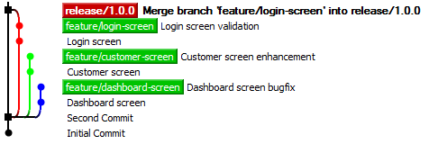

# A simpler Git branching model

SimpleGit is a minimalist git workflow that can be easily understood and adopted. It only has two types of branches: **feature branches** and **release branches**. It is aimed at teams who perform regular software releases, be that weekly, monthly or yearly. If you are releasing more frequently than that, SimpleGit might not be for you. Want to adjust the workflow? Feel free to Fork It.

## Release Branch
Start by creating a branch for your upcoming release:

    git branch release/1.0.0
    git checkout release/1.0.0

## Delete the master branch
SimpleGit advocates meaningful names. The **master** branch has many different meanings depending on the project. With SimpleGit, we delete the master branch.

    git branch -d master

Remember, with git, branches are just pointers. By deleting master, we don't lose any code or commits.

## Feature Branch
A feature branch provides an isolated sandbox to do some work. That work could be to fix a bug, develop a new feature or just to experiment. If you want to switch task, you can commit your half written code to the feature branch without affecting anyone else.

    git checkout -b feature/login-screen

    git commit -m "Commit Message"

## Merge to the release branch
Once you decide your feature is ready to target a particular release, merge it:

    git checkout release/1.0.0

    git merge feature/login-screen --no-ff

## Commit direct to the release branch
If your change is small or your team is small, why not commit directly to the release branch? It's your call, use your best judgement.

## Tag it
When your code is deemed production ready, tag it. SimpleGit advocates [Semantic Versioning - SemVer](http://semver.org/). Any commit with a tag in the form **1.5.3** is deemed a released version. A tag with the form **1.5.3+27** is the 27th build.

## Hat Tip to GitFlow
GitFlow was great. It had nice pictures, it explained concepts like feature branches and release branches and it provided a well documented workflow for developers to collaborate around. But after using GitFlow for a while, I found it didn't fit my needs. So in the Open Source spirit, SimpleGit is like a "fork" of Vincent Driessen's workflow.

## Default Branch
Many Git Servers (GitHub, GitLab, GitStash) allow you to specify a default branch. This branch gets displayed when you browse to the repo via the web interface and gets checked out when you clone the repo. By default, it's usually master. With SimpleGit, it's up to you to set the default branch to whatever release branch you see fit.

##

## A Real History
The famous gitflow diagram looks great, but doesn't look like a real commit history.
Here's a real commit history, viewed in the popular open source client, TortoiseGit.

## Releases, Features and Tags

## A Branch is just a pointer

## Fork Me

## Semantic Versioning - SemVer